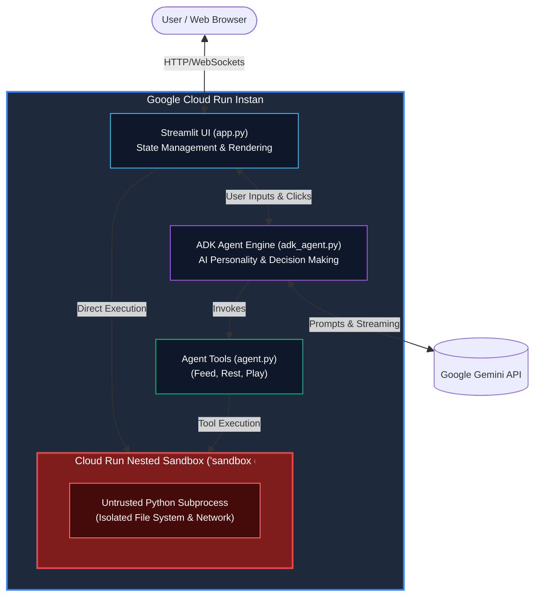

# Agentgotchi

## What is this app?
**Agentgotchi** is an AI-powered virtual companion that lives in Google Cloud Run! Powered by the **Google Agent Development Kit (ADK)** and **Gemini Flash Models**, Agentgotchi features an autonomous brain that tracks its internal state (Hunger, Happiness, Energy), reasons over its environment, and interacts with you via natural language chat and responsive action buttons.

It can eat quantum treats, rest in standby mode, share spontaneous concise thoughts, and execute untrusted Python "trick scripts" securely inside **Cloud Run Nested Sandboxes (`sandbox do`)**. The sandbox can even dynamically calculate polygon math to design custom wearable SVG accessories (such as a royal crown) that render live on the pet's hologram!

---

## High-Level Application Architecture
The application is built on a streamlined, high-performance Python runtime:



---

## Key Features
- **💡 Cost-Effective Always-On Compute:** Leverages long-lived Cloud Run Instances (preview) to provide a cost-effective, persistent runtime ideally suited for continuous virtual pet state and background AI processing.
- **🎩 AI Fashion Designer (Sandbox Crown Generator):** Untrusted Python math scripts calculate 7-point polygon coordinates dynamically in `sandbox do` and render royal crown SVG accessories on the pet's head, complete with an automatic 4.5-second JavaScript fade-out and state reset.
- **🛡️ Sandbox Security Proof-of-Concept:** Built-in exploit testing presets demonstrate gVisor isolation in real time by blocking attempts to write to `/etc/passwd` or steal `GEMINI_API_KEY` from `/proc`.
- **💬 Interactive ADK Chat:** Converse bidirectionally with your pet using Gemini; the agent automatically invokes tools in response to conversational requests.

---

## Run Locally

**Prerequisites:** Python 3.10+

1. Create a virtual environment and install dependencies:
   ```bash
   python3 -m venv .venv
   source .venv/bin/activate
   pip install -r requirements.txt
   ```
1. Run the app locally:

   Using ADC and Gemini Agent Platform (preferred)

   ```bash
   GOOGLE_GENAI_USE_VERTEXAI="1" streamlit run app.py
   ```

   Or using GEMINI_API_KEY

   ```bash
   GEMINI_API_KEY="your-key-here" streamlit run app.py
   ```

1. Run the agent standalone with ADK Web UI:

   ```bash
   GOOGLE_GENAI_USE_VERTEXAI=1 adk web agents --allow_origins='*'
   ```


---

## Deploy to Google Cloud Run

To deploy Agentgotchi to Cloud Run and enable the public preview Code Execution Sandbox feature:

### 1. Prerequisites & IAM Setup
- Ensure you have the Google Cloud CLI (`gcloud`) installed and authenticated to your project.
- Verify your `Dockerfile` installs both Node.js and Python 3.
- Ensure your `.dockerignore` file excludes local `node_modules`.
- **Grant Vertex AI User Role**: When using Vertex AI (`GOOGLE_GENAI_USE_VERTEXAI=1`), give the Cloud Run service account (by default, the Compute Engine default service account) the `Vertex AI User` role (`roles/aiplatform.user`):
  ```bash
  PROJECT_ID=your-project-id
  PROJECT_NUMBER=$(gcloud projects describe $PROJECT_ID --format="value(projectNumber)")

  gcloud projects add-iam-policy-binding $PROJECT_ID \
    --member="serviceAccount:${PROJECT_NUMBER}-compute@developer.gserviceaccount.com" \
    --role="roles/aiplatform.user"
  ```

### 2. Deploy as a Cloud Run Service
Deploy the application from source using `gcloud beta` to access preview features and setting `--sandbox-launcher`:

```bash
REGION=us-west1
PROJECT_ID=your-project-id
```

```bash
gcloud beta run deploy agentgotchi-cloudrun \
  --source . \
  --region $REGION \
  --project $PROJECT_ID \
  --allow-unauthenticated \
  --set-env-vars SECRET_API_KEY=top-secret-value,GOOGLE_GENAI_USE_VERTEXAI=1,GEMINI_MODEL=gemini-3.6-flash \
  --sandbox-launcher
```
*(Note: The `--sandbox-launcher` flag mounts the `sandbox` binary inside your Cloud Run container at runtime, enabling untrusted Python code execution in isolated gVisor sandboxes via `sandbox do`.)*

*(Note: `GEMINI_API_KEY` is passed as an environment variable here specifically to demonstrate the sandbox security isolation feature (proving untrusted scripts cannot read host environment variables). In standard production deployments, you can authenticate Gemini API calls via Vertex AI using the Cloud Run Service Account identity instead of an API key.)*

### 3. Alternative: Deploy as a Cloud Run Instance (Private Preview)
If you have access to Cloud Run Instances, you can deploy Agentgotchi as a long-lived VM Instance instead of an autoscaled Service:

1. **Create the Instance:**
   ```bash
   gcloud alpha run instances create agentgotchi-instance \
     --image="YOUR_IMAGE_URL_HERE" \
     --region us-west1 \
     --port=8080 \
     --set-env-vars SECRET_API_KEY=top-secret-value,GOOGLE_GENAI_USE_VERTEXAI=1 \
     --sandbox-launcher
   ```
2. **Allow Unauthenticated Access:**
   ```bash
   gcloud alpha run instances update agentgotchi-instance \
     --region us-west1 \
     --no-invoker-iam-check
   ```
